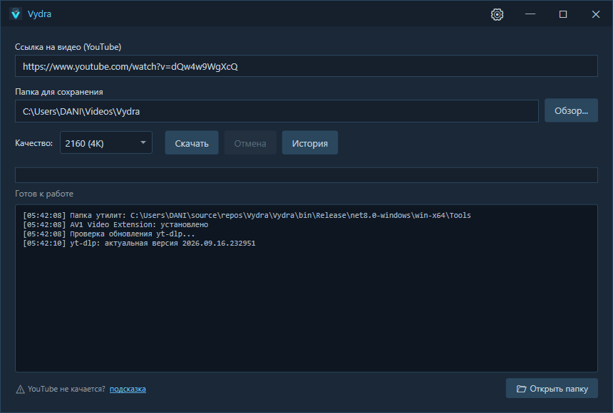
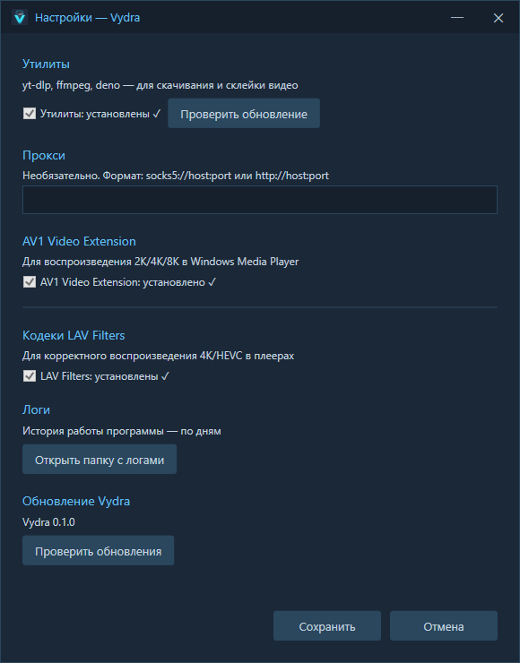

# Vydra

Простой загрузчик видео с YouTube для Windows.

---

## 📥 Скачать / Download

**[⬇ Последний релиз / Latest release](https://github.com/danix64/Vydra/releases/latest)**

---

Выберите язык / Choose language:

🌍 Русский

Скачивайте видео в высоком качестве с удобным тёмным интерфейсом и автоматическим управлением утилитами.

---

## 📥 Установка

1. Скачайте `Vydra-X.X.X-win-x64.zip` со [страницы релизов](https://github.com/danix64/Vydra/releases/latest)
2. Распакуйте в любую папку
3. Запустите `Vydra.exe`

При первом запуске Vydra проверит утилиты и обновит их до актуальных версий.

---

## 📸 Скриншоты

Главное окно

Настройки

---

## ✨ Возможности

- 📥 Скачивание видео с YouTube — 720p, 1080p, 2K, 4K, 8K
- 📜 Скачивание целых плейлистов (для ссылок с плейлистом появляется галочка)
- 🎨 Тёмный интерфейс
- 🔧 Автоскачивание утилит (yt-dlp, ffmpeg, deno)
- 🔄 Автообновление yt-dlp до nightly
- 📖 История загрузок (последние 30)
- 📋 Логи работы программы
- 🎬 Установка LAV Filters одной кнопкой
- 🖼 Проверка AV1-расширения для 4K

---

## 💻 Системные требования

- Windows 10 / 11 (x64)
- Не требует установки .NET Runtime

---

## ❓ FAQ

Windows SmartScreen блокирует запуск при первом открытии

**Почему это происходит:**
Vydra — бесплатная open-source программа. Она не подписана платным сертификатом разработчика (это стоит ~200 $/год). Поэтому Windows SmartScreen предупреждает о «неизвестном издателе».

**Это НЕ вирус.** Так работают все open-source программы без подписи — например, yt-dlp, qBittorrent (portable), OBS (до подписи).

**Что делать:**
1. В окне SmartScreen нажмите **«Подробнее»** (маленькая серая ссылка слева)
2. Появится кнопка **«Выполнить в любом случае»** — нажмите её
3. Программа запустится и **больше не будет спрашивать**

**Альтернатива:** можно добавить папку с Vydra в исключения Windows Defender (Параметры → Безопасность Windows → Защита от вирусов → Исключения).

YouTube не качается

Возможно, ваш провайдер блокирует YouTube. Vydra не может обойти блокировку самостоятельно — это задача системных утилит.

Используйте **Zapret** (бесплатно, для DPI-блокировок) или **VPN**.

После включения обхода — вернитесь в Vydra и попробуйте снова.

Чёрный экран при воспроизведении 4K

Установите **LAV Filters** — в настройках ⚙ → секция «Кодеки LAV Filters».

Также убедитесь, что **AV1 Video Extension** установлено (для 2K+). Установить можно в ⚙ → секция «AV1 Video Extension».

Где хранятся настройки и логи

- Настройки: `%AppData%\Vydra\settings.json`
- Логи: `%AppData%\Vydra\logs\`
- История: `%AppData%\Vydra\history.json`

Открыть папку с логами: ⚙ → секция «Логи» → «Открыть папку с логами».

🌎 English

Download videos in high quality with a clean dark interface and automatic tool management.

---

## 📥 Installation

1. Download `Vydra-X.X.X-win-x64.zip` from the [releases page](https://github.com/danix64/Vydra/releases/latest)
2. Unpack to any folder
3. Run `Vydra.exe`

On first launch, Vydra will check tools and update them to latest versions.

---

## 📸 Screenshots

Main window

Settings

---

## ✨ Features

- 📥 Download YouTube videos — 720p, 1080p, 2K, 4K, 8K
- 📜 Download entire playlists (a checkbox appears for playlist links)
- 🎨 Dark interface
- 🔧 Auto-download of tools (yt-dlp, ffmpeg, deno)
- 🔄 Auto-update of yt-dlp to nightly
- 📖 Download history (last 30)
- 📋 Program logs
- 🎬 LAV Filters installation in one click
- 🖼 AV1 extension check for 4K

---

## 💻 System Requirements

- Windows 10 / 11 (x64)
- No .NET Runtime required

---

## ❓ FAQ

Windows SmartScreen blocks launch

**Why:**
Vydra is a free open-source app. It's not signed with a paid developer certificate (~$200/year). Windows SmartScreen warns about "unknown publisher".

**This is NOT a virus.** All unsigned open-source apps work this way — yt-dlp, portable qBittorrent, OBS (before signing).

**What to do:**
1. In SmartScreen window click **"More info"** (small gray link)
2. Click **"Run anyway"**
3. App will launch and **won't ask again**

**Alternative:** add the Vydra folder to Windows Defender exclusions.

YouTube doesn't download

Your ISP may be blocking YouTube. Vydra can't bypass the block — it's a job for system utilities.

Use **Zapret** (free, for DPI blocks) or **VPN**.

After enabling bypass — return to Vydra and try again.

Black screen when playing 4K

Install **LAV Filters** — in settings ⚙ → section "LAV Filters codecs".

Also make sure **AV1 Video Extension** is installed (for 2K+). Install in ⚙ → section "AV1 Video Extension".

Where are settings and logs stored

- Settings: `%AppData%\Vydra\settings.json`
- Logs: `%AppData%\Vydra\logs\`
- History: `%AppData%\Vydra\history.json`

Open logs folder: ⚙ → section "Logs" → "Open logs folder".

---

## 📄 Лицензия / License

[MIT](LICENSE)
